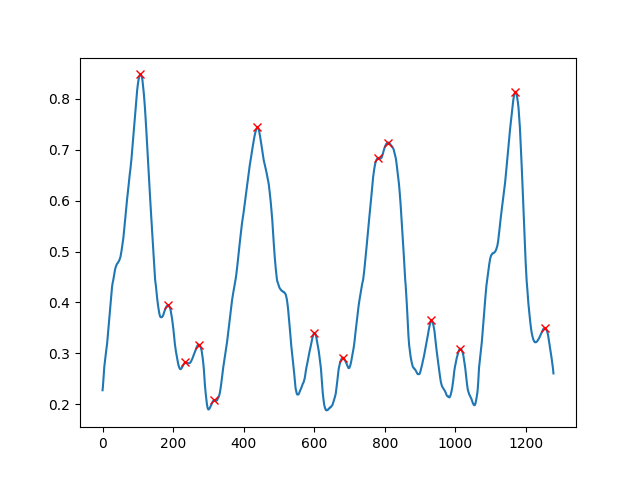
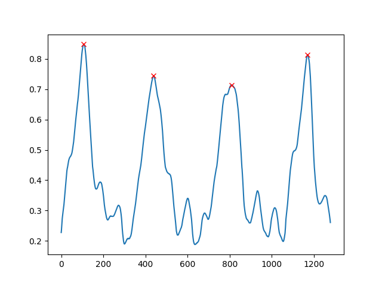

```python
import numpy as np
import pandas as pd
from scipy.signal import find_peaks
import matplotlib.pyplot as plt

# 数据读入，整理为一维结构
x = pd.read_csv("./resp_data_pred.csv")
x = x.iloc[:, 1]

# 寻峰 M1
peaks, _ = find_peaks(x, height=0)

# 绘图
plt.plot(x)    # 绘制原曲线
plt.plot(peaks, x[peaks], "x", color='r')    # 绘制峰值点
plt.show()
```



```python
# 寻峰 M2，设置峰间距获得主要峰--[最实用]--
peaks, _ = find_peaks(x, distance=200)
```



```python
# 寻峰 M3，设置峰凸起度筛选足够凸起的峰
# prominence 指峰值与该峰基线的垂直距离，两个参数限定 prominence 范围
peaks, properties = find_peaks(x, prominence=(0.4, 1))
```


